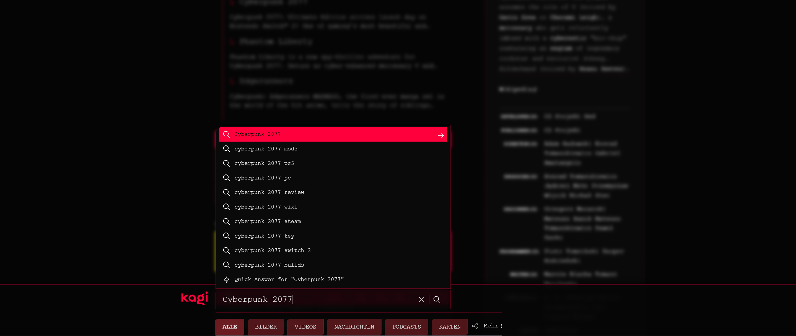
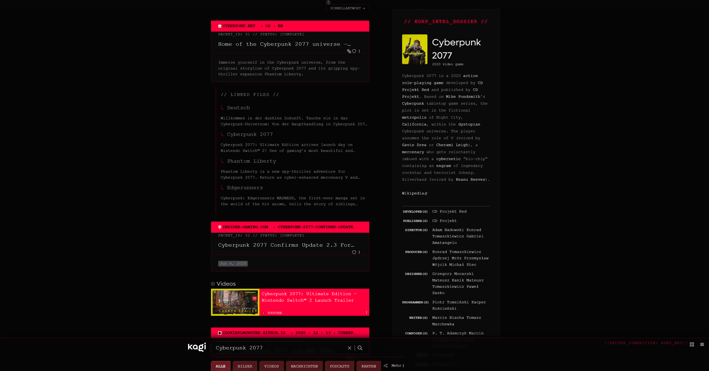
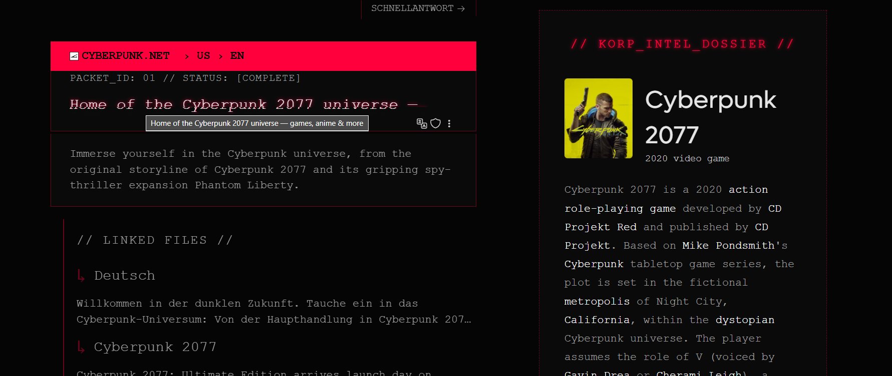
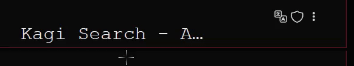
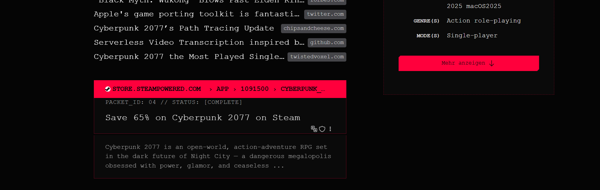
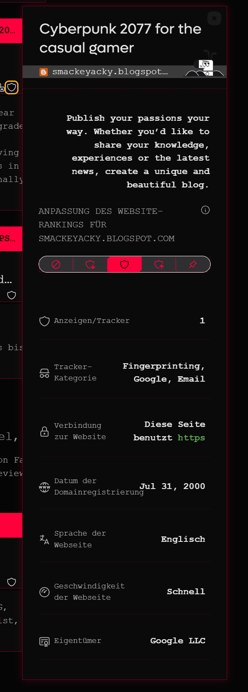
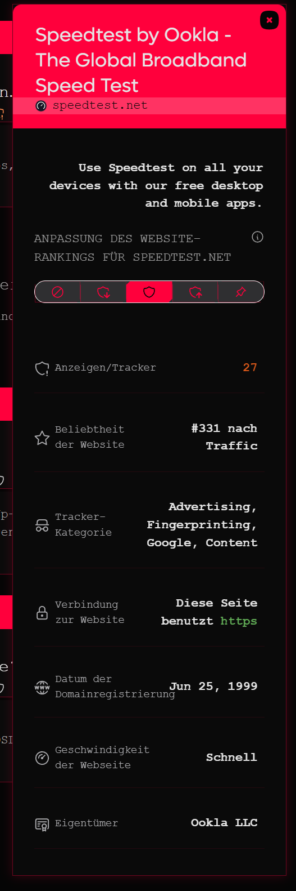
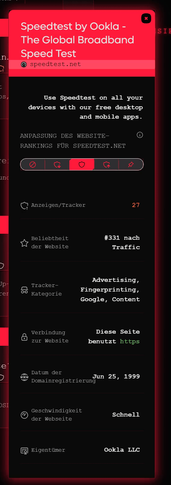

# KORP_NET: A Dystopian Interface for Kagi Search
## Stop browsing. Start diving deep into the search!

This project represents a total redesign of the Kagi search engine's standard UI into a dystopian corporate terminal, inspired by Cyberpunk 2077's aesthetics and brutalist retro-futuristic system contexts. 

This is more than just dark mode — it's a complete redesign of the system. Every search feels like a command, and each result is treated as if it were a data packet extracted from a secure mainframe. Every interaction is designed to feel precise and controlled with a hint of danger.

---

---

---

---

## // SYSTEM_FEATURES_ENABLED
*Dystopian Color Palette*: A void of absolute black is punctuated by the aggressive, cautionary glow of red (#FF3B45) and the sterile white of system text.

*Bottom-Docked Command Line*: The entire search interface is relocated to a persistent command bar at the bottom of the screen, keeping system control at your fingertips at all times.

*Tactical UI Elements*: Every button, from main navigation to a simple "Show Less" link, matches the sharp, multilayered, tactile design language of the cyberpunk universe.

*Immersive "Data-Packet" Results*: Search results are no longer just links. Each result is presented as a secure data packet, complete with a red header bar, packet ID, and system status.

*"Intel Dossier" Sidebar*: When available, Wikipedia information is displayed in a "KORP-Intel-Dossier" panel styled as a classified intelligence briefing. Caution: This could be strictly confidential data!

*Dynamic Glitch & Blur Effects*: Activating the command line blurs the background, focusing your attention on the query. Result titles glitch and degrade under your cursor, simulating an unstable connection to the corporate mainframe.

*Full UI Consistency*: Every pop-up, menu, and modal — from the site-info panel to the "More" dropdown — has been meticulously themed to ensure a completely immersive experience.

*Authentic Buttons*: The buttons are original replicas from the concept design directly from the designers of the game.

---

*Security report for a website*: New color scheme for the safety report in the colors of the corporate design.

|  |  |  |
|------------------------------|------------------------------|------------------------------|
| Normal state                 | Website contains a high amount of trackers | Website is potentially dangerous |

*Note*: The website “speedtest.net” is only an example and only serves to illustrate the last stage and does not actually reflect the state of danger.

## // INSTALLATION_PROTOCOL
1. Download the `final.css` file from this repository.
2. Enable custom CSS in Kagi Settings.
3. Paste the code into the inputfield at: [Link](https://kagi.com/settings?p=custom_css)
4. Save and enjoy your enhanced Kagi experience!

optional: It is intended that the "URL Placement” setting will be set to “Above Title” under the “Appearance” item.

## // (OPTIONAL) ADVANCED_MODIFICATION
The startup animation, which fills the entire screen, could be annoying for some users, especially those who use it frequently. The section has therefore been marked in the code and can be easily removed.

## // CREDITS & ACKNOWLEDGEMENTS
- Concept & Vision: ME :D

- Inspiration: The incredible UI/UX design of Cyberpunk 2077 by CD PROJEKT RED. (Link: https://www.behance.net/gallery/133185623/Cyberpunk-2077User-Interface-(Part-2))

- Many thanks again to @rogue AU for sharing the tool https://css.github.io/csso/csso.html and also to the creator of the tool, without whom the project would not have been ready for release.
